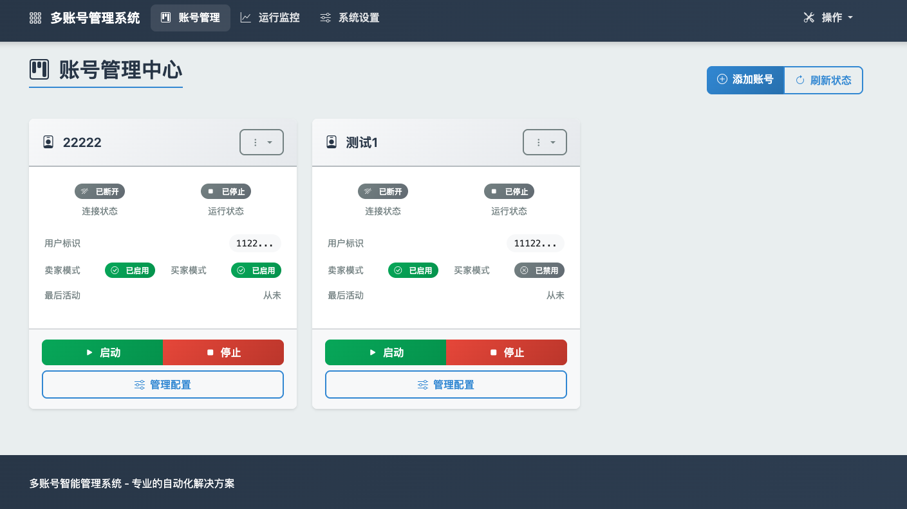
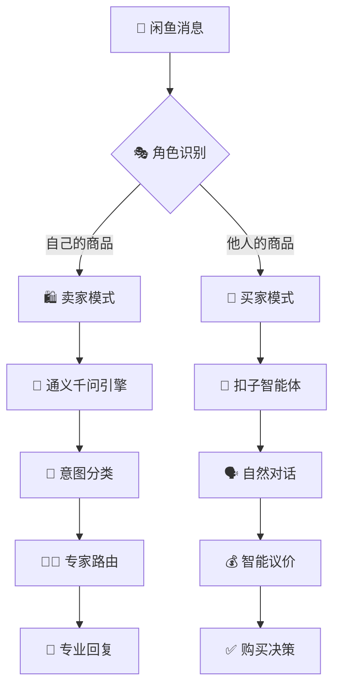

# 🤖 闲鱼智能代理系统 - 多账号双模式AI助手

[](https://www.python.org/)
[](https://platform.openai.com/)
[](#)
[](#)

🚀 **专业的闲鱼AI自动化解决方案** - 支持多账号管理、买家卖家双模式、24小时智能值守

---

## 🌟 核心特色

### 🔥 多账号管理系统

- **💼 账号矩阵**: 支持无限多账号并行运行
- **🎛️ Web控制台**: 可视化管理界面，实时监控
- **⚙️ 独立配置**: 每个账号独立设置提示词和功能
- **📊 状态监控**: 实时查看连接状态、消息统计、错误监控

### 🎭 智能双模式系统

```
🛍️ 卖家模式                    🛒 买家模式
┌─────────────────┐         ┌─────────────────┐
│ 通义千问 Agent   │         │ 扣子智能体      │
│ • 专业客服回复   │         │ • 自然对话风格   │
│ • 智能议价策略   │         │ • 真人议价谈判   │
│ • 技术问题解答   │         │ • 理性购买决策   │
│ • 订单跟踪服务   │         │ • 商品信息问询   │
└─────────────────┘         └─────────────────┘
```

### 🧠 AI引擎架构

<div align="center">
  <table>
    <tr>
      <td align="center" style="padding: 20px; border: 2px solid #4CAF50; border-radius: 10px; background: linear-gradient(135deg, #f5f7fa 0%, #c3cfe2 100%);">
        <h3>🤖 通义千问 引擎</h3>
        <p><strong>🎯 应用场景</strong>：卖家模式</p>
        <p><strong>✨ 技术优势</strong>：专业、准确、可控</p>
        <p><strong>💬 对话效果</strong>：</p>
        <em>"您好，这款商品成色九成新，功能完好"</em>
      </td>
      <td width="50"></td>
      <td align="center" style="padding: 20px; border: 2px solid #FF6B35; border-radius: 10px; background: linear-gradient(135deg, #ffecd2 0%, #fcb69f 100%);">
        <h3>🤖 扣子智能体</h3>
        <p><strong>🎯 应用场景</strong>：买家模式</p>
        <p><strong>✨ 技术优势</strong>：自然、灵活、真人感</p>
        <p><strong>💬 对话效果</strong>：</p>
        <em>"嗯，东西成色怎么样？包邮吗？"</em>
      </td>
    </tr>
  </table>
</div>

---

## 🎯 功能矩阵

### 🛍️ 卖家AI能力

- ✅ **智能客服**: 7×24小时自动回复咨询
- ✅ **专家分类**: 意图识别 → 专家路由（议价/技术/客服）
- ✅ **阶梯议价**: 基于策略的价格谈判系统
- ✅ **技术支持**: 专业的产品技术问题解答
- ✅ **上下文记忆**: 完整对话历史管理

### 🛒 买家AI能力

- ✅ **商品问询**: 自然询问商品详情、成色、发货
- ✅ **智能议价**: 基于预算和策略的价格谈判
- ✅ **购买决策**: 理性分析商品价值和购买时机
- ✅ **真人对话**: 扣子智能体驱动，更自然的表达
- ✅ **防骚扰**: 避免重复消息，智能对话管理

### 🔧 系统管理

- ✅ **Web管理界面**: 直观的账号管理和配置
- ✅ **实时监控**: 运行状态、消息统计、错误追踪
- ✅ **配置迁移**: 从单账号版本无缝升级
- ✅ **人工接管**: 随时切换手动/自动模式
- ✅ **日志管理**: 分账号记录，便于调试分析

---

## 🎨 效果展示

<div align="center">
  <table>
    <tr>
      <td align="center"><strong>🛍️ 卖家专业客服</strong></td>
      <td align="center"><strong>🛒 买家自然对话</strong></td>
    </tr>
    <tr>
      <td></td>
      <td></td>
    </tr>
    <tr>
      <td align="center"><em>专业回复，客服体验</em></td>
      <td align="center"><em>自然询问，真人感觉</em></td>
    </tr>
  </table>
</div>

<div align="center">
  <table>
    <tr>
      <td align="center"><strong>🎯 智能议价策略</strong></td>
      <td align="center"><strong>📊 Web管理界面</strong></td>
    </tr>
    <tr>
      <td></td>
      <td></td>
    </tr>
    <tr>
      <td align="center"><em>阶梯降价，智能策略</em></td>
      <td align="center"><em>实时监控，便捷管理</em></td>
    </tr>
  </table>
</div>


---

## 🚀 快速开始

### 📋 环境要求

- **Python**: 3.8+ 版本
- **系统**: Windows/macOS/Linux
- **内存**: 建议 2GB+ 可用内存
- **网络**: 稳定的网络连接

### ⚡ 一键部署

```bash
# 1. 克隆项目
git clone https://github.com/shaxiu/XianyuAutoAgent.git
cd XianyuAutoAgent

# 2. 安装依赖
pip install -r requirements.txt

# 3. 配置环境（必需）
cp .env.example .env
# 编辑 .env 文件，填入你的配置

# 4. 启动系统
./start.sh    # Linux/macOS
# 或
python main_multi.py    # Windows

# 5. 访问管理界面
# 浏览器打开: http://localhost:5002
```

### 🔧 核心配置

在 `.env` 文件中配置以下必需参数：

```bash
# 🤖 AI模型配置（必需）
API_KEY=your_qwen_api_key                # 通义千问API密钥
MODEL_BASE_URL=https://dashscope.aliyuncs.com/compatible-mode/v1
MODEL_NAME=qwen-max

# 🎭 扣子智能体配置（买家AI可选）
COZE_API_KEY=your_coze_api_key          # 扣子API密钥
COZE_BUYER_BOT_ID=your_buyer_bot_id     # 买家智能体ID

# 🌐 Web界面配置
WEB_HOST=0.0.0.0                        # 访问地址
WEB_PORT=5002                           # 访问端口

# ⚙️ 系统参数
HEARTBEAT_INTERVAL=15                   # 心跳间隔(秒)
LOG_LEVEL=INFO                          # 日志级别
```

### 📝 扣子智能体配置（可选但推荐）

买家AI使用扣子智能体能获得更自然的对话效果：

1. **注册扣子账号**: 访问 [coze.cn](https://coze.cn)
2. **创建智能体**: 设计买家人格和对话风格
3. **获取配置**: 复制API Key和Bot ID
4. **配置环境**: 添加到 `.env` 文件中

> 💡 **提示**: 不配置扣子也能正常使用，买家AI会自动降级到通义千问

详细配置指南: [📖 扣子配置说明](COZE_BUYER_SETUP.md)

---

## 📚 使用指南

### 🎯 添加第一个账号

1. **访问管理界面**: http://localhost:5002
</
2. **点击"添加账号"**
3. **填写账号信息**:
   - 账号名称: 便于识别的名字
   - 用户ID: 闲鱼用户ID
   - Cookie: 从浏览器获取的Cookie字符串
4. **选择功能模式**:
   - ☑️ 卖家回复: 作为卖家自动回复买家
   - ☑️ 买家回复: 作为买家自动与卖家沟通
5. **点击"创建账号"**

### 🔍 获取Cookie方法

```bash
# 在闲鱼网页版(xianyu.com)中:
1. 打开开发者工具 (F12)
2. 切换到 Network 标签
3. 点击 Fetch/XHR 过滤
4. 刷新页面或点击任意请求
5. 在请求头中找到 Cookie 字段
6. 复制完整的 Cookie 值
```

### ⚙️ 自定义提示词

每个账号可以独立配置5类提示词：

| 提示词类型 | 文件位置 | 应用场景 |
|-----------|---------|---------|
| **意图分类** | `classify_prompt.txt` | 识别用户消息类型 |
| **价格谈判** | `price_prompt.txt` | 处理议价相关消息 |
| **技术咨询** | `tech_prompt.txt` | 回答产品技术问题 |
| **默认回复** | `default_prompt.txt` | 处理一般性对话 |
| **买家策略** | `buyer_prompt.txt` | 买家模式对话策略 |

### 🎛️ 系统管理命令

```bash
# 启动系统
./start.sh

# 停止系统
./stop.sh

# 查看状态
./status.sh

# 查看实时日志
tail -f logs/system.log
```

---

## 🏗️ 系统架构

### 🔄 消息处理流程



### 🏢 多账号架构

```
📊 Web管理控制台
    ↓
🎛️ 多账号管理器
    ↓
┌─────────────┬─────────────┬─────────────┐
│   账号 A     │   账号 B     │   账号 C     │
│  🛍️ 卖家模式  │  🛒 买家模式  │  🔄 双模式   │
│  独立配置    │  独立配置    │  独立配置    │
│  独立日志    │  独立日志    │  独立日志    │
└─────────────┴─────────────┴─────────────┘
    ↓         ↓         ↓
  📊 数据库A   📊 数据库B   📊 数据库C
```

---

## 📊 监控面板

### 🎯 实时状态监控

访问 http://localhost:5002/monitor 查看：

- **🔌 连接状态**: 各账号在线情况
- **📈 消息统计**: 收发消息数量和频率
- **⚠️ 错误监控**: 异常情况和处理结果
- **⏰ 运行时长**: 账号持续运行时间
- **💾 资源占用**: CPU和内存使用情况

### 📋 日志管理

- **实时日志**: Web界面查看当前运行日志
- **历史记录**: 按日期和账号查询历史日志
- **错误分析**: 自动标记和分类错误信息
- **性能分析**: 响应时间和处理效率统计

---

## 🔧 高级功能

### 🎛️ 人工接管模式

```bash
# 在聊天中发送句号(.)切换人工接管
用户: "商品还在吗？"
AI: "在的，成色九成新"
用户: "."              # 切换到人工模式
系统: "已切换到人工接管模式"
# 此后消息不会自动回复，需要手动处理
用户: "."              # 再次发送切换回AI模式
系统: "已恢复AI自动回复"
```

### 🔄 配置热更新

无需重启系统即可更新配置：

- ✅ 提示词修改立即生效
- ✅ 功能开关实时切换
- ✅ 参数调整动态加载

### 📈 A/B测试支持

比较不同配置的效果：

- 🆚 多套提示词并行测试
- 📊 效果数据自动统计
- 🎯 最优配置智能推荐

### 🛡️ 安全防护

- 🔐 **Cookie安全**: 加密存储敏感信息
- 🚫 **频率限制**: 防止被平台限流
- 🛡️ **异常处理**: 自动恢复和错误报告
- 📝 **审计日志**: 完整的操作记录

---

## 🆚 版本对比

| 特性 | V1.0 单账号版 | V2.0 多账号版 | V3.0 双引擎版 |
|------|-------------|-------------|-------------|
| **账号数量** | 1个 | 无限制 | 无限制 |
| **管理界面** | 命令行 | Web界面 | Web界面 |
| **卖家AI** | 通义千问 | 通义千问 | 通义千问 |
| **买家AI** | ❌ | 通义千问 | 扣子智能体 |
| **配置管理** | 文件配置 | 数据库 | 数据库 |
| **实时监控** | ❌ | ✅ | ✅ |
| **人工接管** | ✅ | ✅ | ✅ |

---

## 🛠️ 故障排除

### 🔍 常见问题

**Q: 账号连接失败，显示Cookie无效？**

```bash
A: Cookie可能已过期，请重新获取:
1. 清除浏览器缓存
2. 重新登录闲鱼网页版
3. 按步骤重新获取Cookie
4. 在Web界面更新账号配置
```

**Q: AI回复不符合期望？**

```bash
A: 调整对应的提示词:
1. 进入账号配置页面
2. 选择"提示词配置"标签
3. 编辑对应场景的提示词
4. 保存后立即生效
```

**Q: 买家AI没有使用扣子智能体？**

```bash
A: 检查扣子配置:
1. 确认.env中有COZE_API_KEY和COZE_BUYER_BOT_ID
2. 验证扣子API密钥是否有效
3. 检查智能体ID是否正确
4. 查看日志中的具体错误信息
```

**Q: Web界面无法访问？**

```bash
A: 检查服务状态:
1. 运行 ./status.sh 查看系统状态
2. 确认端口5002没有被占用
3. 检查防火墙设置
4. 查看logs/system.log中的错误信息
```

### 🔧 性能优化

**内存占用优化**:

```bash
# 减少日志级别
LOG_LEVEL=WARNING

# 调整心跳间隔
HEARTBEAT_INTERVAL=30

# 限制同时运行账号数
# 建议单机不超过10个账号
```

**网络连接优化**:

```bash
# 增加重试间隔
RETRY_INTERVAL=60

# 设置连接超时
CONNECTION_TIMEOUT=30
```

---

## 🤝 参与贡献

### 🎯 贡献指南

欢迎提交Issue和Pull Request来改进项目：

1. **🐛 Bug报告**: 详细描述问题和复现步骤
2. **💡 功能建议**: 说明需求背景和预期效果
3. **📝 代码贡献**: 遵循代码规范，添加测试用例
4. **📚 文档改进**: 完善使用说明和API文档

### 👥 开发团队

** [@MannersMakesMan](https://github.com/MannersMakesMan)**- 产品设计与AI方案实现

** [@MannersMakesMan](https://github.com/MannersMakesMan)**- 闲鱼逆向工程与API开发

### 🙏 致谢

本项目基于以下开源项目构建：

- [XianyuAutoAgent](https://github.com/shaxiu/XianyuAutoAgent)**] - 闲鱼智能闲鱼客服机器人系统
- 感谢所有贡献者的支持和反馈
- [XianYuApis](https://github.com/cv-cat/XianYuApis) - 闲鱼API接口
- 感谢所有贡献者的支持和反馈
- 

---

## 💼 商业合作

### 🎯 寻求机会

**🔍 研发工程师机会 [@MannersMakesMan](https://github.com/MannersMakesMan)**
专精Python/vue/nodeJs/逆向工程
v联系: wtfm06

### 💡 技术咨询

提供AI自动化解决方案咨询和定制开发服务，欢迎企业用户联系洽谈。

---

## 🎉 社区交流

### 💬 微信交流群

<div align="center">
  <table>
    <tr>
      <td align="center"><strong>📱 交流群 (推荐)</strong></td>
      <td align="center"><strong>🔥 技术讨论群</strong></td>
    </tr>
    <tr>
      <td></td>
      <td></td>
    </tr>
    <tr>
      <td align="center"><em>项目交流、经验分享</em></td>
      <td align="center"><em>技术讨论、问题解答</em></td>
    </tr>
  </table>
</div>

加入交流群，与其他用户分享使用经验，获取技术支持，了解最新功能更新。

---

## ☕ 支持项目

如果这个项目对您有帮助，欢迎请我们喝杯咖啡 ☕

<div align="center">
  <table>
    <tr>
      <td align="center"><strong>💚 微信赞赏</strong></td>
      <td align="center"><strong>🧡 支付宝</strong></td>
    </tr>
    <tr>
      <td></td>
      <td></td>
    </tr>
  </table>
</div>

您的支持是我们持续更新的动力！⭐

---

## 🚀 后续优化方向

### 🌐 网络层优化

#### 🔧 IP代理支持
- **🎯 目标**: 提升账号安全性和稳定性
- **📋 规划**:
  ```bash
  # 支持多种代理协议
  HTTP_PROXY=http://proxy.example.com:8080
  SOCKS5_PROXY=socks5://proxy.example.com:1080
  
  # 账号级别代理配置
  ACCOUNT_PROXY_POOL=[
    {"account_id": "001", "proxy": "http://proxy1.com:8080"},
    {"account_id": "002", "proxy": "socks5://proxy2.com:1080"}
  ]
  
  # 智能代理轮换
  PROXY_ROTATION=true
  PROXY_HEALTH_CHECK=true
  ```
- **🔍 实现计划**:
  - [ ] 集成requests-proxy支持
  - [ ] 添加代理健康检测机制
  - [ ] 实现账号级别的代理绑定
  - [ ] 支持代理池自动轮换
  - [ ] 添加代理失效自动切换

#### 🌍 全球化部署
- **多地域部署**: 支持不同地区的代理节点
- **智能路由**: 根据账号地域自动选择最优代理
- **负载均衡**: 代理池负载分配和故障转移

### 🧠 AI智能化升级

#### 🎭 行业定制智能体
- **🎯 目标**: 针对不同行业提供专业化AI服务
- **📋 行业覆盖**:

| 行业类别 | 智能体特色 | 应用场景 |
|---------|-----------|----------|
| 🎮 **数码3C** | 技术参数专家、性能对比 | "这个显卡能玩什么游戏？" |
| 👗 **服装配饰** | 尺码顾问、搭配建议 | "这件衣服适合什么身材？" |
| 📚 **图书文具** | 内容推荐、学习建议 | "这本书适合什么年龄段？" |
| 🏠 **家居用品** | 空间设计、使用建议 | "这个家具适合多大的房间？" |
| 🚗 **汽车配件** | 兼容性检查、安装指导 | "这个配件适合我的车型吗？" |
| 💄 **美妆护肤** | 肤质分析、产品推荐 | "这个适合敏感肌肤吗？" |

- **🔧 技术实现**:
  ```bash
  # 行业智能体配置
  INDUSTRY_BOTS={
    "digital": "digital_expert_bot_id",
    "fashion": "fashion_consultant_bot_id", 
    "books": "book_advisor_bot_id",
    "home": "home_designer_bot_id"
  }
  
  # 商品分类自动识别
  AUTO_CATEGORY_DETECTION=true
  CATEGORY_CONFIDENCE_THRESHOLD=0.8
  ```

#### 🎨 提示词智能优化
- **📊 数据驱动优化**:
  - [ ] 对话效果分析系统
  - [ ] A/B测试框架
  - [ ] 成功率统计和优化建议
  - [ ] 用户满意度反馈收集

- **🤖 自适应学习**:
  - [ ] 基于历史对话优化提示词
  - [ ] 行业术语自动学习
  - [ ] 个性化回复风格调整
  - [ ] 季节性话术自动更新

- **🎯 智能体升级计划**:
  ```bash
  V4.0 规划:
  ├── 🏭 行业专家智能体矩阵
  ├── 🧠 自学习提示词系统  
  ├── 📊 对话质量评估系统
  ├── 🎨 个性化回复风格
  └── 🌍 多语言支持能力
  ```

### 🏗️ 代码架构重构

#### 📐 系统架构优化
- **🎯 目标**: 提升代码可维护性和扩展性
- **🔧 重构计划**:

  **当前问题诊断**:
  ```bash
  ❌ 模块耦合度高
  ❌ 配置管理分散
  ❌ 错误处理不统一
  ❌ 测试覆盖率低
  ❌ 文档不够完善
  ```

  **目标架构设计**:
  ```
  🏗️ 新架构设计
  ├── 📦 core/                 # 核心业务逻辑
  │   ├── agents/             # AI智能体模块
  │   ├── messaging/          # 消息处理模块
  │   └── auth/              # 认证授权模块
  ├── 🌐 api/                 # API接口层
  │   ├── xianyu/            # 闲鱼API封装
  │   ├── ai/                # AI服务接口
  │   └── webhooks/          # Webhook处理
  ├── 💾 storage/             # 数据存储层
  │   ├── database/          # 数据库操作
  │   ├── cache/             # 缓存管理
  │   └── files/             # 文件存储
  ├── 🎛️ web/                # Web界面
  │   ├── frontend/          # 前端代码
  │   ├── backend/           # 后端API
  │   └── static/            # 静态资源
  └── 🔧 utils/              # 工具函数
      ├── config/            # 配置管理
      ├── logging/           # 日志系统
      └── monitoring/        # 监控工具
  ```

#### 🧪 开发规范化
- **📋 开发流程优化**:
  - [ ] 统一代码风格 (Black + isort)
  - [ ] 类型注解完善 (Type Hints)
  - [ ] 单元测试覆盖 (pytest + coverage)
  - [ ] API文档自动生成 (FastAPI + Swagger)
  - [ ] CI/CD流水线搭建 (GitHub Actions)

- **📊 质量监控**:
  ```bash
  # 代码质量检查
  make lint          # 代码风格检查
  make test          # 运行单元测试
  make coverage      # 测试覆盖率
  make security      # 安全漏洞扫描
  make performance   # 性能基准测试
  ```

#### 🔌 插件化架构
- **🎯 目标**: 支持第三方功能扩展
- **📋 插件系统设计**:
  ```python
  # 插件接口定义
  class AgentPlugin:
      def on_message_received(self, message): pass
      def on_message_sent(self, message): pass
      def on_user_action(self, action): pass
  
  # 插件配置
  ENABLED_PLUGINS=[
      "sentiment_analysis",    # 情感分析插件
      "auto_translate",       # 自动翻译插件
      "price_monitor",        # 价格监控插件
      "customer_insights"     # 客户洞察插件
  ]
  ```

### 📅 开发时间线

| 阶段 | 时间规划 | 主要任务 | 交付成果 |
|------|---------|---------|----------|
| **Phase 1** | Q3 2025 | 代码重构 + IP代理 | 🏗️ 新架构 + 🌐 代理支持 |
| **Phase 2** | Q4 2025 | 行业智能体开发 | 🎭 6大行业专家 |
| **Phase 3** | Q1 2026 | AI优化 + 插件系统 | 🧠 自学习AI + 🔌 插件架构 |
| **Phase 4** | Q2 2026 | 全球化 + 企业版 | 🌍 多地部署 + 💼 商业版本 |

---

### 🎯 参与贡献

欢迎社区开发者参与以上优化方向的开发：

- **🔗 IP代理模块**: 网络专家，熟悉代理协议
- **🤖 行业智能体**: AI专家，了解特定行业
- **🏗️ 架构重构**: 后端工程师，系统架构经验
- **🎨 前端优化**: 前端工程师，UI/UX设计
- **📱 移动端**: 移动开发，跨平台经验

**参与方式**:
1. 在GitHub Issues中认领任务
2. Fork项目并创建特性分支
3. 提交PR并参与Code Review
4. 加入技术讨论群交流想法

---

## ⚖️ 免责声明

> ⚠️ **重要提醒**
> 
> 本项目仅供学习和技术交流使用，不得用于任何违法违规的商业活动。
> 
> 使用本项目所产生的一切后果由使用者自行承担，开发团队不承担任何责任。
> 
> 如有侵权或违规使用，请联系我们及时删除。

---

## 📄 开源协议

本项目采用 MIT 协议开源，详情请查看 [LICENSE](LICENSE) 文件。

---

<div align="center">

**🚀 让AI为你的闲鱼生意保驾护航！**


